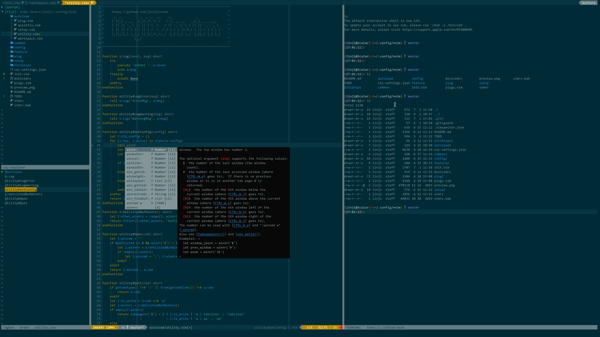

# .vim



## Clone Vim configuration

```bash
git clone --depth=1 https://github.com/linjiX/.vim.git ~/.vim
```

## Installation (Ubuntu 16.04)

```bash
~/.vim/setup/install_vim.sh
```

It will take a long time, make sure your network is unblocked and be patient.

## Fonts

Vim may meet some display issues in your machine.  
The reason is your terminal font doesn't support powerline or nerd-fonts.  
Here is a recommended font: <https://github.com/linjiX/Consolas-with-Yahei>

```bash
# For Ubuntu 16.04
mkdir -p ~/.local/share/fonts
git clone --depth=1 https://github.com/linjiX/Consolas-with-Yahei.git
cp Consolas-with-Yahei/ttf/* ~/.local/share/fonts/
```

Then enable it in your terminal.

---

#### Select a colorscheme for yourself, then enjoy your Vim!

---

## How to update

```bash
cd ~/.vim
git pull
vim ~/.vim/vimrc.plug
:PlugUpdate
:CocUpdateSync
:qa
```

## Language Support

#### Git

```bash
pip3 install gitlint
```

#### Bash (Ubuntu 16.04)

```bash
npm install --global bash-language-server
snap install shfmt
snap install shellcheck
```

#### Python

```bash
pip3 install \
    black \
    isort \
    ipython \
    pylint \
    flake8 \
    mypy
```

#### C/C++ (Ubuntu 16.04)

```bash
pip3 install cpplint
./setup/install_clang_format.sh
./setup/install_cppcheck.sh
./setup/install_ccls.sh
```

#### Bazel (Ubuntu 16.04)

```bash
./setup/install_buildifier.sh
```

#### Json

```bash
pip3 install demjson
npm install --global prettier
./setup/install_jq.sh
```

#### Markdown

```bash
npm install --global prettier
npm install --global markdownlint-cli
```

#### Cmake

```bash
pip3 install \
    cmake_format \
    cmakelint
```

#### Dockerfile

```bash
npm install --global dockerfile-language-server-nodejs
./setup/install_hadolint.sh
```

#### Php

```bash
./setup/install_phpcs.sh
```

#### Xml

```bash
npm install --global prettydiff
```

#### VimScript

```bash
pip3 install vim-vint
```
